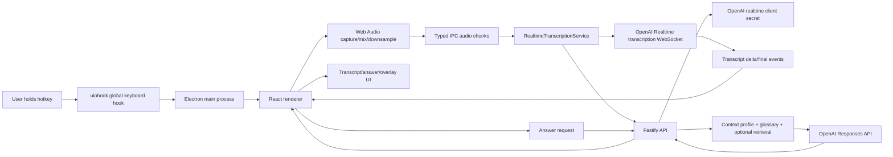
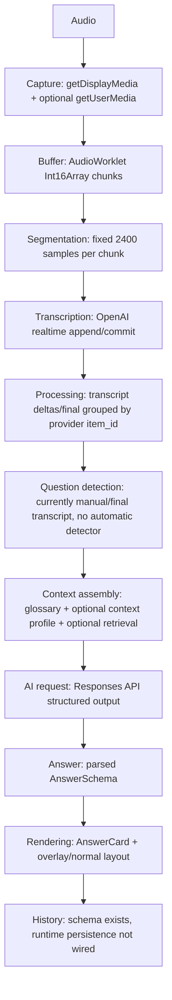

# Architecture map

## Platform composition

Meeting Copilot is a hybrid desktop/backend/web product:

- Desktop app: Electron main + preload + React renderer.
- Backend API: Fastify service.
- Shared contracts: Zod schemas and TypeScript DTOs.
- Database package: Drizzle schema/migrations for PostgreSQL + pgvector.
- Public website: static React/Vite landing page.

No browser extension, Tauri app, mobile app, or native desktop implementation was found.

## High-level architecture

## End-to-end product flow

## Step inventory

| Step | File/class | Input | Output | State | External dependency | Timeout/retry/fallback | Bottleneck | Persisted data |
| --- | --- | --- | --- | --- | --- | --- | --- | --- |
| Hotkey | `HotkeyService` | OS keydown/up | IPC hotkey events | active flag | `uiohook-napi` | no retry | global hook reliability | none |
| Desktop source | `main/index.ts`, `SourcePicker` | Electron sources | selected source ID | `selectedDesktopSourceId` | Electron desktopCapturer | fallback to first source | wrong source selection | setting not persisted separately |
| Audio capture | `AudioCapture` | display media, optional mic | PCM ArrayBuffer chunks | streams/context | browser media APIs | none | permission/source failures | none |
| Buffer/chunking | AudioWorklet source | Float32 audio | 2400-sample PCM16 chunk | internal Int16Array | Web Audio | none | CPU/downsampling | none |
| Transcription start | `RealtimeTranscriptionService.start` | settings | WebSocket session | socket/committed/failed | API + OpenAI | 10s WS open timeout | secret/session setup | none |
| Append/commit | `RealtimeTranscriptionService` | chunks | provider events | committed flag | OpenAI Realtime | no retry | network/provider latency | none |
| Transcript UI | `use-copilot.ts` | delta/final events | textarea text | React state/ref | none | animation-frame batching | delta concat correctness | none |
| Submit answer | `use-copilot.ts` | final transcript | API answer | state thinking/error | backend | 60s fetch timeout in main API client | full response wait | none |
| Context | `AnswerService` | transcript/profile/glossary | prompt JSON | none | DB, retrieval | no retry | profile/retrieval latency | profile/glossary only |
| AI answer | `AnswerService` | prompt | structured answer | none | OpenAI Responses | no explicit retry | model latency | not persisted |
| Overlay | `setOverlayMode`, CSS | setting | compact window | window bounds | Electron window APIs | fallback bounds restore | usability | settings persisted |

## Runtime boundaries

- Renderer has no Node integration and accesses privileged functionality only through `window.copilot`.
- Backend owns provider API key.
- Desktop can receive short-lived transcription credential via API.
- Database schema supports richer persistence than runtime currently uses.

