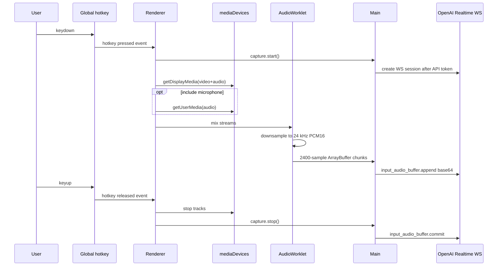

# Audio pipeline audit

## Implementation summary

Audio capture is implemented in `apps/desktop/src/renderer/src/lib/audio-capture.ts` and controlled by `apps/desktop/src/renderer/src/hooks/use-copilot.ts`. Electron grants media permissions in `apps/desktop/src/main/index.ts`.

## Pipeline

## Source and platform behavior

| Topic | Finding |
| --- | --- |
| Primary audio source | `navigator.mediaDevices.getDisplayMedia({ video: true, audio: { channelCount: 1, sampleRate: 48000 } })` |
| System audio on Windows | Electron display handler returns `{ video: source, audio: "loopback" }` on `win32`. |
| System audio on macOS/Linux | Not proven; non-Windows handler returns `{ video: source }`, so system audio likely absent. |
| Microphone | Optional via `getUserMedia` with echo cancellation, noise suppression, and auto gain. |
| Device selector | Desktop source selector exists; no microphone device selector. |
| Sample rate | AudioContext requested at 48 kHz; worklet down-samples to 24 kHz. |
| Channels | Reads `inputs[0][0]`, effectively first channel/mono. |
| Format | PCM16 little-endian ArrayBuffer; base64 encoded in main process. |
| Chunk size | 2400 samples at 24 kHz = approximately 100 ms of audio per chunk. |
| Silence/VAD | No local silence detection. Provider `turn_detection` is explicitly `null`. |
| Echo handling | Only browser microphone constraints; no separation/diarization. |
| CPU/memory | Per-sample averaging/downsampling in worklet; buffer retained between chunks. No observed disk persistence. |

## Error and state visibility

The UI has states for idle, listening, transcribing, ready_to_send, thinking, answering, and error. It does not distinguish:

- no system audio track,
- microphone permission denied,
- selected source unavailable,
- API offline,
- provider rate limited,
- network interrupted.

## Gaps

1. No microphone device selection.
2. No detection that selected desktop stream actually contains audio.
3. No silence filtering; silence is sent if captured during hotkey hold.
4. No platform-specific onboarding for macOS Screen Recording/mic permissions.
5. No audio test fixtures.
6. No metrics for chunk generation rate, dropped chunks, CPU, memory, or stream track end.

## Recommendations

- Add explicit audio diagnostics: track count, track muted/ended, first non-zero PCM timestamp.
- Add microphone device selector and source refresh.
- Add local RMS/VAD metric, at least for "silence detected" warnings and cost control.
- Add test harness with synthetic audio stream to verify chunk size and downsampling.
- Keep push-to-talk and visible indicators; do not make capture hidden.

