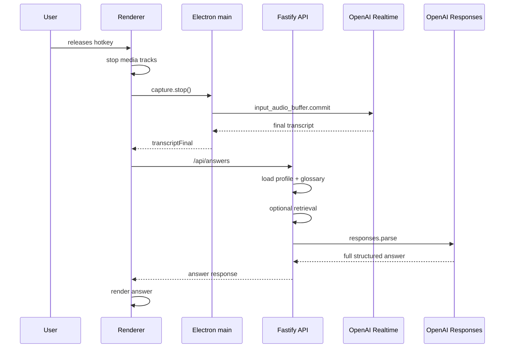

# Latency analysis

## Critical path

## Stage table

| Stage | Existing measurement | Estimate | Bottleneck | Improvement |
| --- | ---: | ---: | --- | --- |
| Hotkey release to commit | none | <100-250ms | stop tracks + IPC | measure; commit before/parallel to stopping tracks if safe |
| Commit to final transcript | none | 300ms-2s | provider finalization | tune delay; consider partial question extraction |
| Final transcript to answer request | none | <50ms | React state/effect | measure with turn timestamps |
| Context/glossary load | none | 10-100ms local/DB | DB query | cache glossary/profile |
| Retrieval | none | 0 by default; 300ms-2s if enabled | external retrieval | keep off for live mode |
| Responses API full answer | none | 800ms-5s | model + schema size | stream/split quick answer |
| Render response | none | <50ms | React render | low risk |

## Fixed waits/debounces

- 10s fixed timeout for WebSocket open.
- 25ms interval wait if stop is requested while start is in flight.
- `requestAnimationFrame` batching for transcript delta UI.
- No polling found.

## Processing duplication

- Transcript is sent as both raw and normalized strings to the model.
- Normalization scans all glossary terms every request.
- Retrieval, if enabled, may call OpenAI Responses before the answer call.

## Recommended metrics

| Metric | Capture point |
| --- | --- |
| `turn.hotkey_down_at` | renderer hotkey handler |
| `turn.first_audio_chunk_at` | `AudioCapture` on first chunk |
| `turn.ws_open_at` | `RealtimeTranscriptionService` open |
| `turn.first_transcript_delta_at` | delta event |
| `turn.final_transcript_at` | final event |
| `turn.answer_request_at` | before API call |
| `turn.answer_response_at` | after API call |
| `turn.error_at` | error event |
| `turn.chunk_count` | main append count |
| `turn.audio_duration_ms` | chunk count * 100ms |

## Top latency reductions

1. Stream/split answer: improves perceived answer latency most.
2. Pre-warm/reuse realtime session where safe: reduces start latency.
3. Add quick heuristic question extraction from partial/final transcript.
4. Keep retrieval off in basic mode.
5. Reduce answer schema for overlay/live mode.

