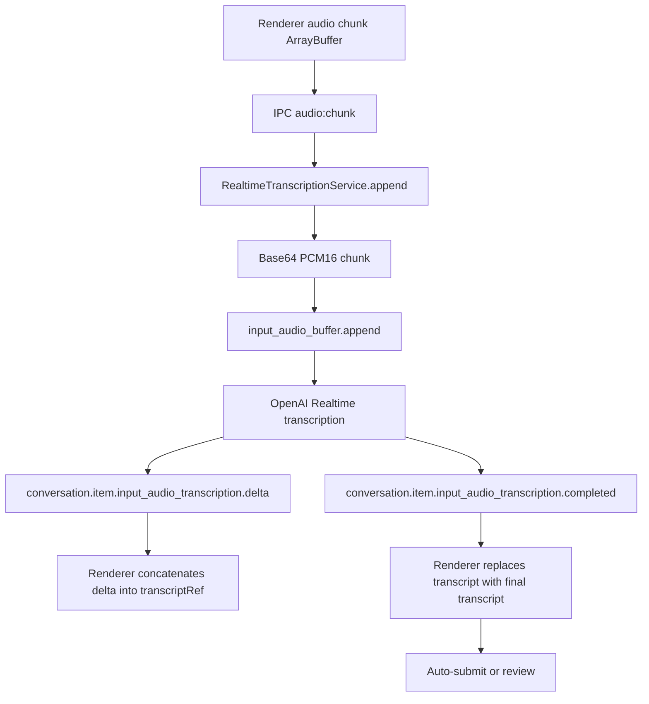

# Transcription pipeline audit

## Provider and mode

Transcription uses OpenAI Realtime transcription sessions. The API creates short-lived client secrets at `POST https://api.openai.com/v1/realtime/client_secrets` in `apps/api/src/modules/realtime-token/service.ts`.

Runtime transcription is remote and streaming. Audio chunks are appended over a WebSocket opened by `apps/desktop/src/main/services/realtime-transcription-service.ts`.

## Flow

## Configuration

| Setting | Source | Value/behavior |
| --- | --- | --- |
| Model | `OPENAI_REALTIME_TRANSCRIPTION_MODEL` | default `gpt-realtime-whisper` |
| Language | desktop settings | `pt`, `en`, `es`, `ru`, `fr`, `it` surfaced |
| Delay | desktop settings | `minimal`, `low`, `medium`, `high`, `xhigh` |
| Audio format | API token session | PCM, 24 kHz |
| Turn detection | API token session | `null`; commit is manual |
| Credential duration | API token service | 600 seconds |
| WS open timeout | main service | 10 seconds |

## Partial/final transcript handling

- Partial events are concatenated by delta in `use-copilot.ts`.
- Final event replaces `transcriptRef.current` and UI textarea with the provider final transcript.
- Deltas are grouped by provider `item_id` in main event payload, but renderer ignores `itemId` and uses a single transcript buffer.
- There is no handling for multiple simultaneous provider item IDs in one active session.

## Latency estimation

| Metric | Existing measurement | Estimate from code | Notes |
| --- | ---: | ---: | --- |
| Audio chunk frequency | none | ~100 ms | 2400 samples at 24 kHz |
| Time to WS connection | none | network/API dependent, bounded by 10s open timeout | token request + WS handshake |
| Time to first partial | none | provider/network dependent | likely after first chunks; not measured |
| Time to final transcript | none | after `commit` and provider finalization | hotkey release triggers commit |

## Risks

- Sending silence: no VAD/silence filtering.
- Duplicates: no deduplication of repeated captures.
- Lost context: only current turn is sent; no rolling transcript buffer.
- Partial mismatch: renderer concatenates deltas without item isolation.
- Unsupported platform behavior: system audio outside Windows is not proven.

## Recommendations

1. Track `itemId` in renderer state and reset/replace per item.
2. Add timing metrics for first append, first delta, final transcript.
3. Add "no speech detected" based on transcript final empty or local RMS.
4. Add retry/reconnect strategy for transient WS errors.
5. Add synthetic audio tests and mocked provider event tests.

