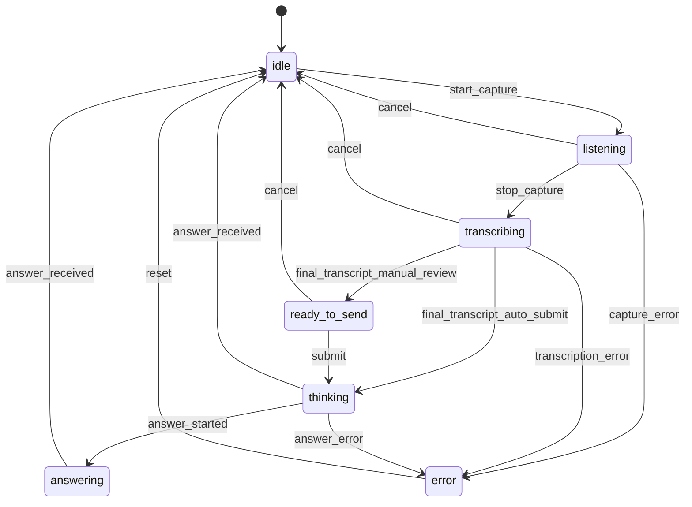

# Turn state machine

## States

## Rules

- A turn has one `turnId`.
- A stale answer response must be ignored if it does not match the active or latest submitted turn.
- Cancel stops local capture and provider transcription.
- Review mode pauses at `ready_to_send`.
- Auto-detect can propose a candidate question but must respect deduplication before submitting.
